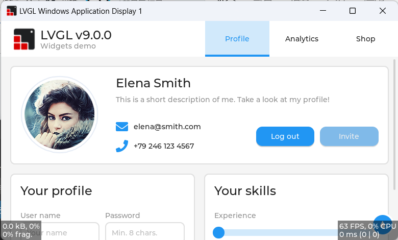

# LVGL for Visual Studio



Note: If you want to use the stable version, please use branches with the
"release/" prefix. The master branch is the current development version which
may contains some issues like compilation failed and etc. Read
https://github.com/lvgl/lv_port_pc_visual_studio/issues/101 for the 2025 Roadmap
of the LVGL Visual Studio repository.

## Introduction

This is a pre-configured Visual Studio project to try LVGL on a Windows PC. The
project only depend on Win32 API, C Runtime and C++ STL, so you can compile it
without any extra dependencies.

The project is currently maintained using Visual Studio 2022. It may well work
without modification in Visual Studio 2019 and 2017 but it is not actively 
supported with that version, so please install and test with Visual Studio 2022
before reporting any bugs.

**This project is not for Visual Studio Code, it is for Visual Studio.**

Instructions for cloning, building and running the application are found below.

## Known Issues

- The LV_MEM_SIZE macro in lv_conf.h should be 128 KiB or larger because you may
  meet the out of memory issue when you are using the 64-bit simulator.
  - Note: In this project, the size is set to 256 KiB.
- Users need to check the target selected in Visual Studio, because the 
  simulator project support ARM64 and Visual Studio will choose ARM64 in the 
  first time because of the alphabetical order.

## Supported Features

### All Mode

- Only depends on Win32 API, C Runtime and C++ STL.
- Native support for x86, x64 and ARM64 Windows.
- Support compiling with [VC-LTL](https://github.com/Chuyu-Team/VC-LTL) 
  toolchain to make the binary size as smaller as using MinGW.
- Support LVGL pointer, keypad and encoder devices integration..
- Support Windows touch input.
- Support Windows input method integration input.
- Support Per-monitor DPI Aware (both V1 and V2).

### Specific for Simulator Mode

- Designed for LVGL simulation scenario.
- Keep the LVGL display resolution all time for trying best to simulate UI 
  layout which will see in their production devices.
- When Windows DPI scaling setting is changed, Windows backend will stretch
  the display content.
- FreeType integration.

### Specific for Application Mode

- Designed for Windows desktop application development scenario.
- Have the Window resizing support and LVGL display resolution will be changed.
- When Windows DPI scaling setting is changed, the LVGL display DPI value will 
  also be changed.

## How to Clone

This repository contains other, necessary LVGL software repositories as 
[git submodules](https://git-scm.com/book/en/v2/Git-Tools-Submodules). Those 
submodules are not pulled in with the normal git clone command and they will be
needed. There are a couple of techniques to pull in the submodules.

### Everything at Once

This command will clone the lv_port_pc_visual_studio repository and all submodules
in a single step.

```
git clone --recurse-submodules https://github.com/lvgl/lv_port_pc_visual_studio.git
```

### Main Repository First, Submodules Second

If you've already cloned the main repository you can pull in the submodules 
with a second command. Both commands are shown below.

```
git clone https://github.com/lvgl/lv_port_pc_visual_studio.git
cd lv_port_win_visual_studio
git submodule update --init --recursive
```

### Keeping Your Clone Up-To-Date

If you have cloned this repository and would like to pull in the latest 
changes, you will have to do this in two steps. The first step will pull in
updates to the main repo, including updated _references_ to the submodules. The
second step will update the code in the submodules to match those references.
The two commands needed to accomplish this are shown below, run these commands
from inside the main repository's directory (top level `lv_port_pc_visual_studio`
directory works fine).

```
git pull
git submodule update --init --recursive
```

If you have chosen to fork this repository then updating the fork from upstream
will require a different, more involved procedure.

## How To Build & Run

Open the `LVGL.sln` solution file in Visual Studio. Set the 
`LvglWindowsSimulator` project as the startup project. Click on the `Local Windows
Debugger` button in the top toolbar.  The included project will be built and 
run, launching from a cmd window.

## Trying Things Out

There are a list of possible test applications in the 
[LvglWindowsSimulator.cpp](LvglWindowsSimulator/LvglWindowsSimulator.cpp) file. Each test or demo
is launched via a single function call. By default the `lv_demo_widgets` 
function is the one that runs, but you can comment that one out and choose any
of the others to compile and run.

Demos outside of the default two widgets (`lv_demo_widgets` and `lv_demo_benchmark`)
can be enabled by editing [lv_conf.h](LvglWindowsSimulator/lv_conf.h) around line 1199
(DEMO USAGE section) and setting the associated variable to 1 instead of 0 (i.e., 
`#define LV_USE_DEMO_MUSIC 0` -> `#define LV_USE_DEMO_MUSIC 1`

Use these examples to start building your own application test code inside the
simulator.

## A Note About Versions

This repository has its submodule references updated shortly afk with minor 
version updates. When submodule updates take place a matching version tag is
added tter the release of new, major releases of LittlevGL's core 
[lvgl](https://github.com/lvgl/lvgl) project. Occasionally it is updated to
woro this repository.

If you need to pull in bug fixes in more recent changes to the submodules you
will have to update the references on your own. If source files are added or
removed in the submodules then the visual studio project will likely need
adjusting. See the commit log for examples of submodule updates and associated
visual studio file changes to guide you.

## Documents

- [ARM32 Support Removed Notice](Documents/Arm32SupportRemovedNotice.md)
- [How to synchronize LVGL related submodules](Documents/HowToSynchronizeLvglRelatedSubmodules.md)
- [Default lv_conf.h Configuration](Documents/DefaultLvglConfigurations.md)
